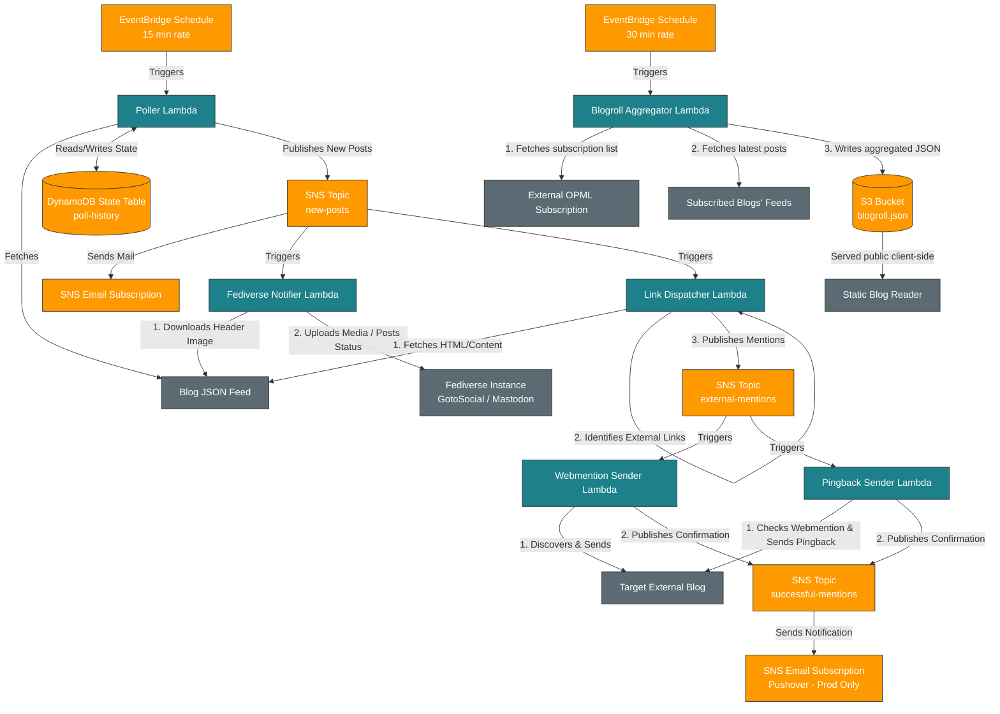

# Bathtub Robot Services Monorepo

This repository is a Serverless monorepo containing Lambda services that compliment a static blog. These are the services used to implement dynamic functionality for Endgame Viable:

*   **blogroll-aggregator**: Periodically parses an OPML subscriptions file, aggregates the latest posts from all subscribed blogs, and uploads the compiled blogroll feed to a public S3 bucket for client-side display.
*   **poller & fediverse-notifier**: Automates polling your blog's JSON feed to detect new posts and publish status notifications (with media attachments) to the Fediverse.
*   **linkback dispatchers (webmention-sender & pingback-sender)**: Scans new blog posts for external links and dispatches linkback notifications (Webmention and Pingback) to target sites.

The project is built with **Node.js 22 (ES Modules)**, **Python 3.11** (for the aggregator), **Go 1.24**, and leverages the **Serverless Framework** for deployment. It includes a complete local integration testing environment composed of **LocalStack**, **PostgreSQL**, and **GotoSocial** running in Docker.

---

## Architecture Overview

Here is the high-level architecture showing how the OPML aggregator, new post poller, and linkback dispatch systems interact:



### Components

1.  **Blogroll Aggregator (`services/blogroll-aggregator`)**:
    *   Triggered every 30 minutes by an **AWS EventBridge Schedule** (written in Python).
    *   Fetches a public OPML subscriptions list (configured via `OPML_URL`).
    *   Downloads RSS/Atom/JSON feeds for all subscribed blogs to find their latest posts.
    *   Outputs a compiled JSON feed (`blogroll.json`) to a public, CORS-enabled **AWS S3 Bucket (`BlogrollBucket`)**.
    *   Allows your static blog frontend to pull and render a dynamic, auto-updating blogroll client-side.
2.  **Poller Service (`services/poller`)**:
    *   Triggered every 15 minutes by an **AWS EventBridge Schedule**.
    *   Fetches the blog's JSON feed (configured via `JSON_FEED_URL`).
    *   Compares fetched URLs against the **DynamoDB State Table** to detect new entries.
    *   If new posts are found:
        *   Writes the new URLs to the state table to prevent duplicate notifications.
        *   Publishes a detailed payload containing the post `title`, `summary`, `image`, and `tags` to the **SNS Topic (`new-posts`)**.
3.  **Fediverse Notifier Service (`services/fediverse-notifier`)**:
    *   Subscribed to the **SNS Topic** and triggered automatically when a new post is published.
    *   Parses the post details from the SNS event.
    *   Cleans summary HTML text, formats blog tags to camelCase `#NoSpaceHashtags`.
    *   If a header image exists, fetches it and uploads it to the Fediverse media endpoint (`/api/v1/media`).
    *   Publishes the status text and the attached media ID to the Fediverse statuses API (`/api/v1/statuses`).
4.  **Link Dispatcher (`services/link-dispatcher`)**:
    *   Subscribed to the **SNS Topic (`new-posts`)**.
    *   Fetches the newly published post's HTML.
    *   Parses and extracts all external URLs (ignoring links inside `<figure>`/diagram blocks).
    *   Publishes individual `{source, target}` payloads to **SNS Topic (`external-mentions`)**.
5.  **Webmention Sender (`services/webmention-sender`)**:
    *   Subscribed to the **SNS Topic (`external-mentions`)** (written in Go).
    *   Performs HTTP GET/HEAD discovery on the target URL to locate `rel="webmention"` headers or tags.
    *   Dispatches an urlencoded HTTP POST containing `source` and `target` URLs.
    *   Publishes confirmations to the **SNS Topic (`successful-mentions`)** (bypassed locally).
6.  **Pingback Sender (`services/pingback-sender`)**:
    *   Subscribed to the **SNS Topic (`external-mentions`)** (written in Go).
    *   Checks if the target supports Webmention *first* (if so, skips to avoid duplicates).
    *   Discovers the XML-RPC server endpoint via `X-Pingback` headers or `rel="pingback"` links.
    *   Dispatches an XML-RPC `pingback.ping` payload.
    *   Publishes confirmations to the **SNS Topic (`successful-mentions`)** (bypassed locally).

---

## Local Testing Environment

To enable fully integrated, mock-free local testing, the project runs:
- **LocalStack (Community Edition)**: Mimics AWS DynamoDB, S3, SNS, and Lambda execution.
- **PostgreSQL (`gts-db`)**: Serves as the database for GotoSocial.
- **GotoSocial (`gotosocial`)**: Provides a local, lightweight Fediverse server with an active web UI.

---

## Makefile Targets

The `Makefile` automates all orchestration, deployments, and testing.

| Target | Description |
| :--- | :--- |
| `make up` | Spins up the Docker Compose containers (`localstack`, `gts-db`, and `gotosocial`) and blocks/waits until all services are healthy and ready to accept traffic. |
| `make down` | Gracefully stops and removes all active Docker Compose containers. |
| `make setup-gts` | Automates the creation and confirmation of the local GotoSocial `admin` account, registers the OAuth application, obtains the access token (saved to `.gts-token`), overrides database columns in PostgreSQL to make the admin profile public and discoverable, and restarts the container to apply changes. |
| `make build-go` | Compiles the Go sender binaries for linux/amd64 and packages them into ZIP artifacts. |
| `make test-go` | Runs all Go consumer unit tests. |
| `make deploy-local` | Deploys Lambdas, DynamoDB, S3 buckets, and SNS topics to the **LocalStack** container. |
| `make test-local` | Manually invokes the local `poller` Lambda in LocalStack using the standard AWS CLI. |
| `make test-aggregator` | Manually invokes the local `blogroll-aggregator` Lambda in LocalStack. |
| `make show-blogroll` | Fetches and prints the current compiled `blogroll.json` from the LocalStack S3 bucket. |
| `make logs-poller` | Tails the local CloudWatch logs for the `poller` Lambda. |
| `make logs-notifier` | Tails the local CloudWatch logs for the `fediverse-notifier` Lambda. |
| `make logs-webmention-sender` | Tails the local CloudWatch logs for the `webmention-sender` Lambda. |
| `make logs-pingback-sender` | Tails the local CloudWatch logs for the `pingback-sender` Lambda. |
| `make clear-posts` | Clears all processed post URLs from the local DynamoDB poll history table. |
| `make get-prod-token` | Runs the OAuth script to request a production token for your live Fediverse server, saving it locally to `.prod-token`. |
| `make prepopulate-aws` | Fetches the live blog JSON feed and pre-populates your production AWS DynamoDB state table to ensure existing posts are not back-notified. |
| `make deploy-aws` | Deploys the service stack directly to AWS. Defaults to the `dev` stage. Run with `STAGE=prod` for production. |
| `make clean` | Reverts the environment completely. Stops and deletes all containers and volumes, and deletes local cache files (`.localstack`, `.gts-storage`, and `.gts-token`). |

---

## Quick Start (Local Run)

1.  **Initialize Environment**:
    ```bash
    cp .env.sample .env
    ```
2.  **Start Services**:
    ```bash
    make up
    ```
3.  **Bootstrap GotoSocial Credentials**:
    ```bash
    make setup-gts
    ```
4.  **Deploy to LocalStack**:
    ```bash
    make deploy-local
    ```
5.  **Trigger Integration Test**:
    ```bash
    make test-local
    ```
6.  **Verify Outgoing Activity**:
    *   Tail notifier logs: `make logs-notifier`
    *   Audit linkbacks: Run `node .agents/skills/webmention-log-viewer/scripts/check-logs.cjs` to view the parsed logs and chronological markdown table of outgoing mentions.
    *   Open your browser to `http://localhost:8080/@admin` to view the public posts with their image attachments and hashtags!
