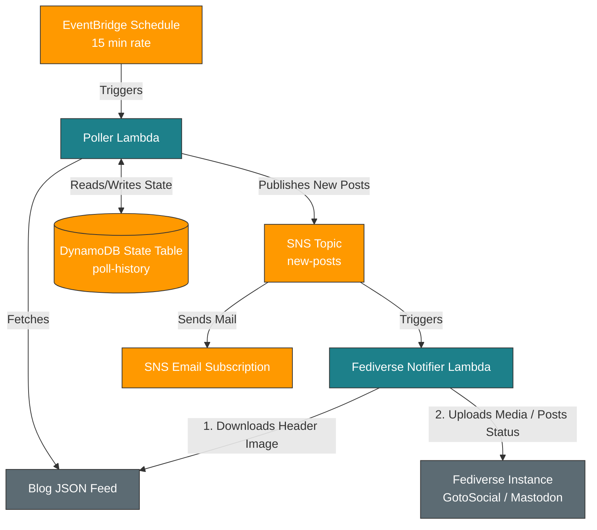

# Bathtub Robot Services Monorepo

This repository is a Serverless monorepo containing Lambda services that compliment a static blog.

## Blogroll Aggregator

The blogroll-aggregator service takes an OPML url, fetches each of the blog's feeds, and writes an output json feed containing the latest post from each blog.

## Poller and fediverse-notifier

Poller and fediverse-notifier automate polling your blog's JSON feed and publishing new post notifications to a target Fediverse instance (e.g., GotoSocial or Mastodon) and an AWS SNS email subscription.

The project is built with **Node.js 22 (ES Modules)** and leverages the **Serverless Framework** for deployment. It includes a complete local integration testing environment composed of **LocalStack**, **PostgreSQL**, and **GotoSocial** running in Docker.

---

## Architecture Overview

Here is the high-level architecture showing how the polling and notification systems interact both in AWS and the local testing setup:



### Components

1.  **Poller Service (`services/poller`)**:
    *   Triggered every 15 minutes by an **AWS EventBridge Schedule**.
    *   Fetches the blog's JSON feed (configured via `JSON_FEED_URL`).
    *   Compares fetched URLs against the **DynamoDB State Table** to detect new entries.
    *   If new posts are found:
        *   Writes the new URLs to the state table to prevent duplicate notifications.
        *   Publishes a detailed payload containing the post `title`, `summary`, `image`, and `tags` to the **SNS Topic**.
2.  **Fediverse Notifier Service (`services/fediverse-notifier`)**:
    *   Subscribed to the **SNS Topic** and triggered automatically when a new post is published.
    *   Parses the post details from the SNS event.
    *   Cleans summary HTML text, formats blog tags to camelCase `#NoSpaceHashtags`.
    *   If a header image exists, fetches it and uploads it to the Fediverse media endpoint (`/api/v1/media`) via native `fetch` and `FormData`.
    *   Publishes the status text and the attached media ID to the Fediverse statuses API (`/api/v1/statuses`).
3.  **Email Notifications**:
    *   An email endpoint is subscribed to the **SNS Topic** directly, sending automated email alerts to the administrator on every new post publication.

---

## Local Testing Environment

To enable fully integrated, mock-free local testing, the project runs:
- **LocalStack (Community Edition)**: Mimics AWS DynamoDB, SNS, and Lambda execution.
- **PostgreSQL (`gts-db`)**: Serves as the database for GotoSocial.
- **GotoSocial (`gotosocial`)**: Provides a local, lightweight Fediverse server with an active web UI.

---

## Makefile Targets

The `Makefile` automates all orchestration, deployments, and testing.

| Target | Description |
| :--- | :--- |
| `make up` | Spins up the Docker Compose containers (`localstack`, `gts-db`, and `gotosocial`) and blocks/waits until all services are healthy and ready to accept traffic. |
| `make down` | Gracefully stops and removes all active Docker Compose containers. |
| `make setup-gts` | Automates the creation and confirmation of the local GotoSocial `admin` account, registers the OAuth application, obtains the access token (saved to `.gts-token`), overrides database columns in PostgreSQL to make the admin profile public and discoverable, and restarts the container to apply changes. |
| `make deploy-local` | Deploys Lambdas, DynamoDB, and SNS topics to the **LocalStack** container, injecting the local DNS endpoint for GotoSocial and the local access token. |
| `make test-local` | Manually invokes the local `poller` Lambda in LocalStack using the standard AWS CLI. |
| `make logs-poller` | Tails the local CloudWatch logs for the `poller` Lambda. |
| `make logs-notifier` | Tails the local CloudWatch logs for the `fediverse-notifier` Lambda. |
| `make clear-posts` | Clears all processed post URLs from the local DynamoDB poll history table. |
| `make get-prod-token` | Runs the OAuth script to request a production token for your live Fediverse server, saving it locally to `.prod-token`. |
| `make prepopulate-aws` | Fetches the live blog JSON feed and pre-populates your production AWS DynamoDB state table to ensure existing posts are not back-notified. |
| `make deploy-aws` | Deploys the service stack directly to AWS. Defaults to the `dev` stage. Run with `STAGE=prod` for production. |
| `make clean` | Reverts the environment completely. Stops and deletes all containers and volumes, and deletes local cache files (`.localstack`, `.gts-storage`, and `.gts-token`). |

---

## Quick Start (Local Run)

1.  **Initialize Environment**:
    ```bash
    cp .env.sample .env
    ```
2.  **Start Services**:
    ```bash
    make up
    ```
3.  **Bootstrap GotoSocial Credentials**:
    ```bash
    make setup-gts
    ```
4.  **Deploy to LocalStack**:
    ```bash
    make deploy-local
    ```
5.  **Trigger Integration Test**:
    ```bash
    make test-local
    ```
6.  **Verify Outgoing Activity**:
    *   Tail notifier logs: `make logs-notifier`
    *   Open your browser to `http://localhost:8080/@admin` to view the public posts with their image attachments and hashtags!
